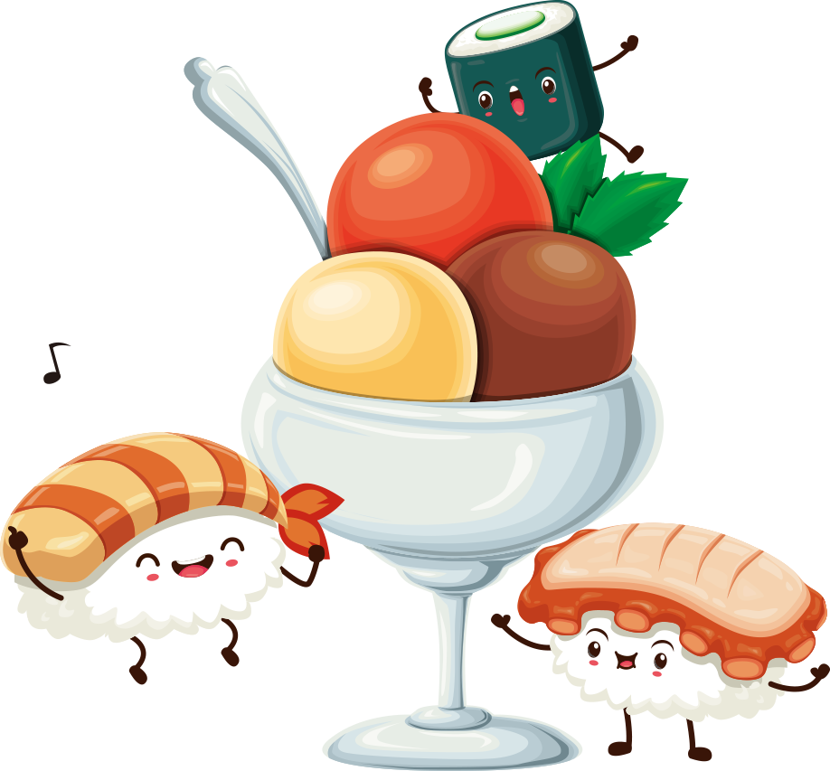

  
# Sushi Quiz

**Table of Contents**

1. [Introduction](#introduction)
2. [Technologies Used](#technologies-used)

**Live Demo**
[Sushi Quiz on GitHub Pages](https://staysee.github.io/sushi_quiz_v2)
[Sushi Quiz on Repl](https://repl.it/@staysee/Sushi-Quiz)

## Introduction

Do you love sushi? Are you sure you know what you are eating? Alright sushi master...let's see how you roll!

Take this 10 question quiz to test your sushi knowledge.
To prove yourself you must score 8 points or higher!

## Technologies Used
This sushi quiz is built with HTML, CSS, JavaScript, jQuery, GoogleFonts